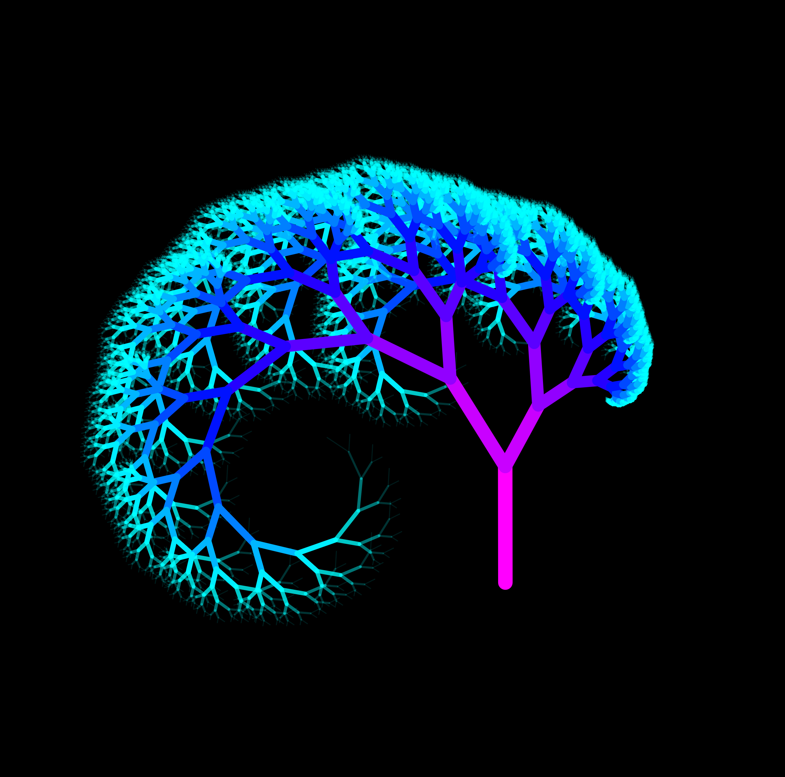
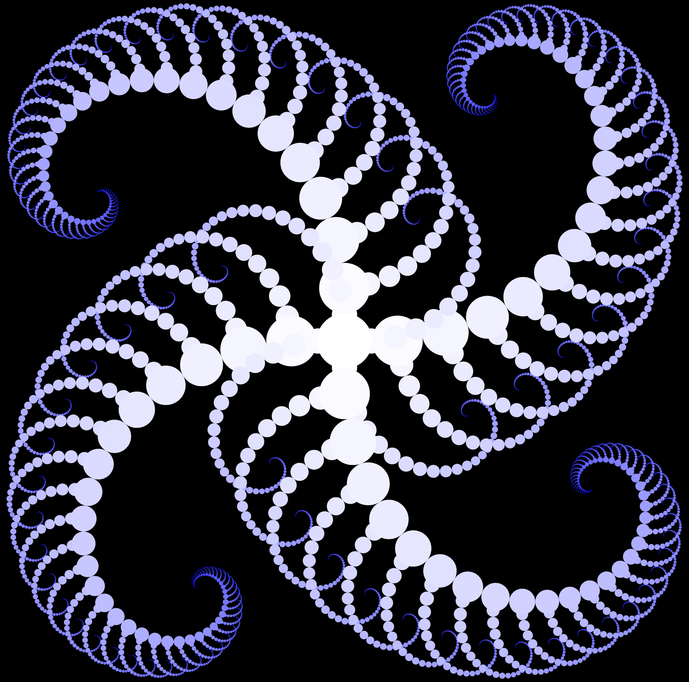
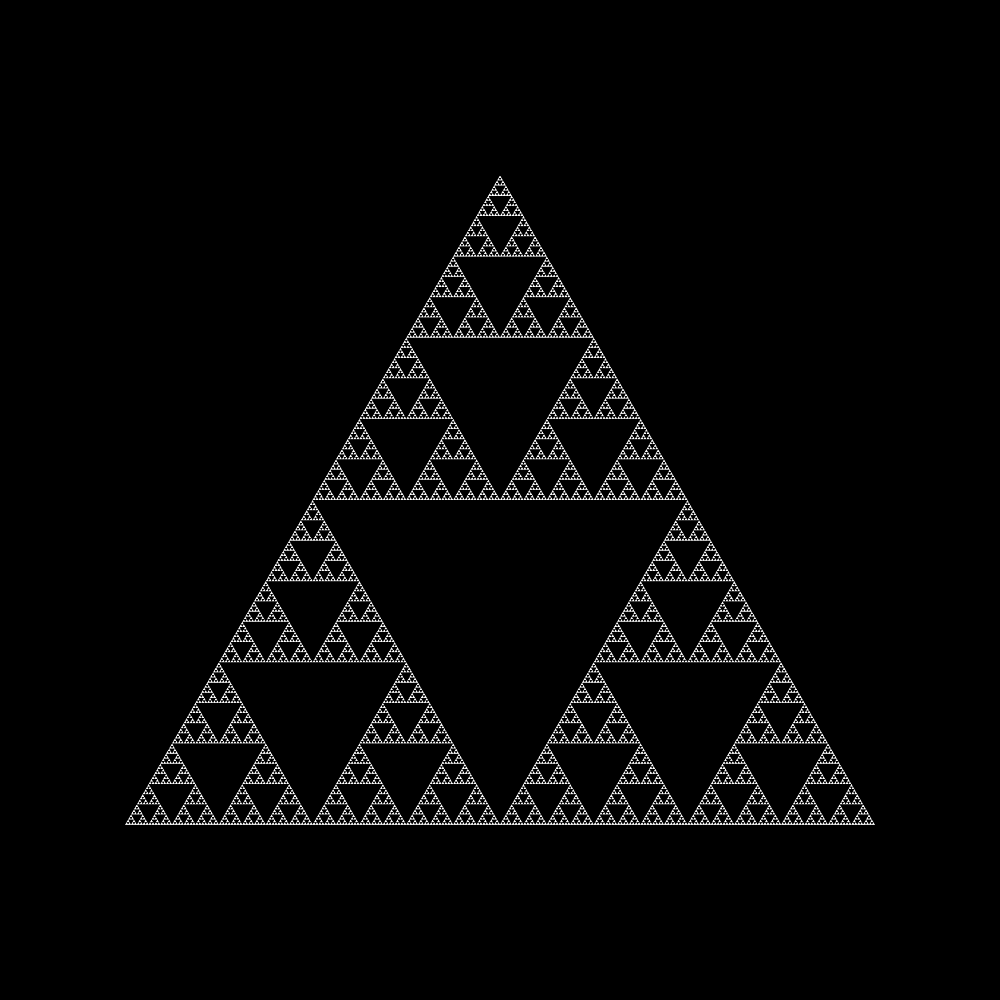

# p5.js examples
This repository contains examples of recursive art code (most of which) I wrote for a workshop. It uses the [p5.js](https://p5js.org/) library.

## Setup
The code contains a separate site in each folder and can be run online using the p5.js [online editor](https://editor.p5js.org/) or locally. The easiest way to get set up locally would likely be with the [Live Server](https://marketplace.visualstudio.com/items?itemName=ritwickdey.LiveServer) and [p5.vscode](https://marketplace.visualstudio.com/items?itemName=samplavigne.p5-vscode) VScode extensions. For furhter help, just check out [p5js.org](https://p5js.org/).

## Examples

- recursive branches with a beautiful color gradient

- spiral circle pattern of my own invention, also makes use of a color gradient

- can't have recursive art without the classic triangle!

